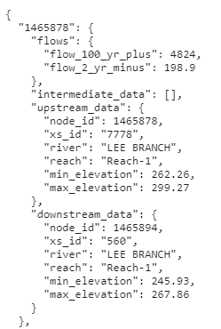

# ripple
Utilities for reuse of HEC-RAS models for NWM. HEC-RAS models must be cataloged in a Spatial Temporal Asset Catalog (STAC) and conflated with the NWM reach dataset prior to processing through ripple. 

## Contents
- /conflate: RAS-FIM Conflation
- /stacio: Build and update STAC items
- /exe: Build RAS Terrains and add to STAC items
- /examples: examples

## Getting Started
To utilize this repository to develop flood inundations maps from 1D steady-state HEC-RAS models the following are required:
- A Windows operating system
- HEC-RAS 6.3.1 installed
- Python packages specified in requirements-windows.txt installed
- Access to s3
- An href for a STAC item containing the following minimum content:
    - Assets representing the necessary HEC-RAS files with role assigned as "RAS-FILE"
        - HEC-RAS project file
        - HEC-RAS geometry file 
        - HEC-RAS plan file
        - HEC-RAS flow file

    - Assets for HEC-RAS terrain data with role assigned as "RAS-TOPO"
        - RAS_Terrain.hdf
        - RAS_Terrain.tif
        - RAS_Terrain.vrt 

    - An asset for a geopackage containing the model geometry with role "RAS-GEOMETRY-GPKG"

    - An asset containing conflation parameters with assigned role "RIPPLE-PARAMS".
        The conflation parameters asset should be a nested json which contains a key for each NWM branch associated with RAS model. The parameters shown below must exists for each NWM branch.

            

## About
Producing inundation maps at half-foot increments for each NWM branch in a given RAS model is a multi-step process outlined below. "run_process.py" is a script that executes the process in the necessary sequential order. 

1. Read the input STAC item
2. Download HEC-RAS files
3. Load NWM conflation parameters.
2. Determine flow increments for each NWM branch in the RAS model using upper and lower flow ranges specified in conflation parameters. Default is 10 increments.
3. For each NWM branch, write a flow and plan file for an initial run using the incremented flows. 
4. For each NWM branch, Use the results from the initial run to develop rating curves at the upstream and downstream terminus of each NWM branch. 
5. For the upstream rating-curve of each branch, determine what flows would be needed to produce half-foot increments.
6. For the downstream rating-curve of each branch, determine depths at half-foot increments over the range of flows applied to the branch. 
7. Convert the downstream depths to water surface elevations
8. For each NWM branch create a production-run flow/plan file. 
    - The discharges derived from the upstream rating-curve are applied at the top of the HEC-RAS river-reach
    - The water surface elevations derived from the downstream rating-curve are applied as an intermediate known water surface elevation at the downstream terminus of the NWM branch
9. Run the production-runs with post-processing depth rasters toggled on
10. For each NWM branch, clip each resulting depth raster to a concave hull derived from the cross sections associated with each branch.
11. For each NWM branch read the HDF results and write rating-curves to sqlite db.  

 
 
 

# REST API

## About the API

The REST API server leverages huey for concurrent task (job) execution, and Flask as the user HTTP REST interface into the huey
system. The HTTP endpoints adhere closely to [OGC Process API](https://ogcapi.ogc.org/processes/overview.html) standards.

## Environment Requirements of the API

1. Windows host with Desktop Experience, due to its usage of the HEC-RAS GUI.
1. Python 3.8 or higher, with dependencies installed per requirements.txt.
1. HEC-RAS installed, and EULA accepted. For each version of RAS, open the program once to read and accept the EULA.

## API Launch Steps

1. If necessary, edit [.flaskenv](.flaskenv) (do not store any secrets or credentials in this file!)
1. If necessary, initialize or edit `.env`, e.g. for data access credentials. Care should be taken not to include the same variable names in [.flaskenv](.flaskenv) and in `.env`.
1. If necessary, edit [api-start.bat](api-start.bat) to:
    1. Adjust the number of threads (cores) that huey will use to process concurrent tasks (jobs).  By default, [api-start.bat](api-start.bat) is configured to inspect the number of cores on the host machine and use a value of (N - 2), with a minimum of 1.
    1. Adjust the huey logging behavior.  By default, the huey logs will not stream to the terminal, and will instead stream to a local file.
    1. Adjust the huey consumer path.  By default, a typical such path is assumed in [api-start.bat](api-start.bat).
1. Double-click [api-start.bat](api-start.bat). This will cause two Windows terminals to open. One will be running huey and the other will be running Flask. **Warning: this will delete and re-initialize the `api\logs\` directory, which includes the huey tasks database in addition to the log files.**
1. Double-click [api-test.bat](api-test.bat). This will send a request to the ping endpoint of the API confirming that it is online and ready to process jobs.

## API Administration Notes

**Warning: [api-start.bat](api-start.bat) will delete and re-initialize the `api\logs\` directory, which includes the huey tasks database in addition to the log files.**

huey is configured to use a local SQLite database as its store for managing tasks and storing their returned values. If the db file
does not exist, it will be created when the huey consumer is executed. If it does exist, it will be used as-is and not overridden.
Therefore if the server administrator needs to ungracefully stop all tasks and/or re-start the server, then if they want to be sure that
any existing tasks are fully cleared / removed from the system, they should manually delete the db file themselves before re-starting
the server.

The SQLite method is highly stable, but there may be rare instances in which a "lock" race condition error may occur under heavy load.
If this is a concern, the server administrator could reconfigure huey to use another store supported by huey, such as Redis.
