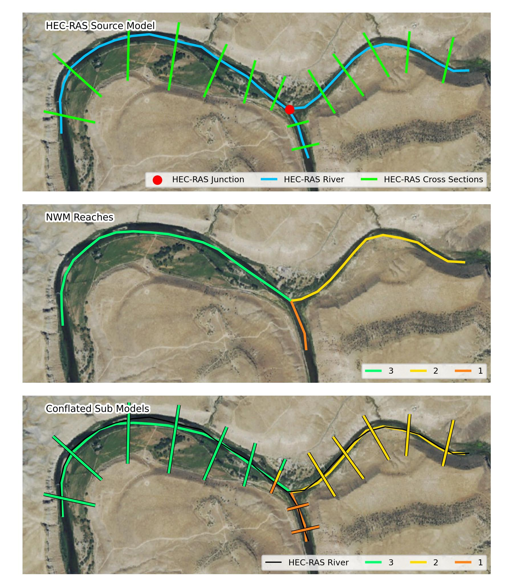
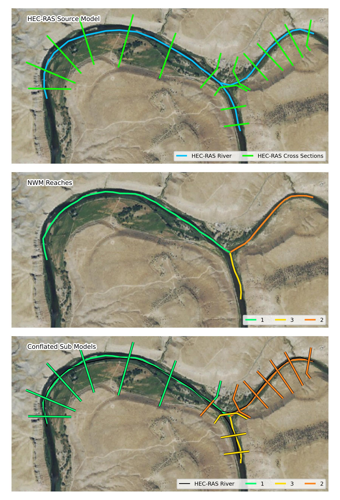

conflate_model
##############

**URL:** ``/processes/conflate_model/execution``

**Method:** ``POST``

**Description:**

.. autofunction:: ripple1d.ops.ras_conflate.conflate_model
    :no-index:

********************
Conflation Behavior
********************

Below are several examples depicting how a HEC-RAS model would be conflated to
the National Water Model (NWM) network.

**Conflation Test A**

In this scenario a single HEC-RAS source model is split into four sub models.
The sub model for each NWM reach contains all intersecting RAS ross-sections
plus one downstream. The downstream cross-section thus matches the upstream-most
cross-section of the next downstream sub model (multi-colored sections in the
third panel), creating a seamless FIM.

Reach 4 does not have any intersecting HEC-RAS cross-sections, however, it is
sandwiched by two NWM reaches with sub models.  In this situation, the NWM reach
is marked as "eclipsed".

**Conflation Test B**

This scenario mimics a HEC-RAS model with multiple reaches (only mainstem shown).
Since the HEC-RAS reaches are contained within a single NWM reach, the sub model
is created by joining all HEC-RAS cross-sections together.

**Conflation Test C**

This scenario shows that multiple NWM reaches may be eclipsed in sequence.

**Conflation Test D**

When the next downstream reach of a model would be a junction, the sub model
takes the first cross-section downstream of the junction as its downstream limit.

**Conflation Test D**

When the next downstream reach of a model would be a junction, the sub model
takes the first cross-section downstream of the junction as its downstream limit.

**Conflation Test E**

Similarly to Test E, when two HEC-RAS reaches confluence, the sub models will
share a downstream cross-section with the most upstream cross-section of the
downstream model (shared between three models).

**Conflation Test F**

Same as Test E.

**Conflation Test G**

A sub model may traverse both an eclipsed reach and a confluence to find the
next downstream cross-section.

**Conflation Test H**

Same as Test G but with the eclipsed reach downstream of the confluence.

**Conflation Test I**

In this test, the confluences between the NWM and HEC-RAS are not aligned. The
NWM confluence is upstream of a cross-section on one of the tributary HEC-RAS
reaches.  Further complicating the setup, NWM reach 3 intersects cross-sections
along the confluencing HEC-RAS reach.

After ripple1d completes initial conflation, if it finds that the HEC-RAS model
has been conflated with a NWM confluence (i.e., a NWM reach has both children)
present in the conflation.json, it will force both tributary sub models to
have a downstream cross-section at the first section downstream of the HEC-RAS
junction and the downstream sub model to have an upstream cross-section at that
section.

**Conflation Test J**

This test was created in response to `github issue #311 <https://github.com/Dewberry/ripple1d/issues/311>`_.
This scenario verifies that NWM reaches will not conflate to nearby HEC-RAS
models that to not overlap the reach extents.

**Conflation Test K**

See description of Test J.  This complex confluence geometry is still locked
such that the sub models will be on their appropriate tributary and contain the
first cross-section downstream of the junction as their shared cross-section.

**Conflation Test L**

In this example, the HEC-RAS model does not contain a junction.  Sub model 3
will therefore not share a cross-section with 1 and 2.

**Conflation Test M**

In this scenario, a first order NWM reach only intersects some of the HEC-RAS
cross-sections.  When additional cross-sections are available upstream of a
first order tributary, ripple1d will extend one cross-section upstream of the
last cross-section to provide complete reach coverage.

**Conflation Test N**

When an NWM reach overlaps cross-sections from two HEC-RAS reaches, sections
that would be conflated backwards are removed and then the RAS reached
overlapping the largest continuous length of NWM reach are selected as the final
conflated reach.
