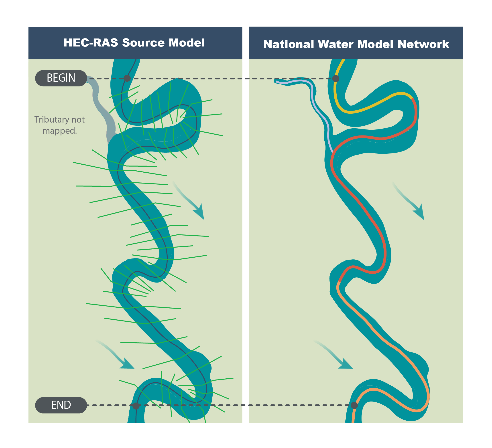
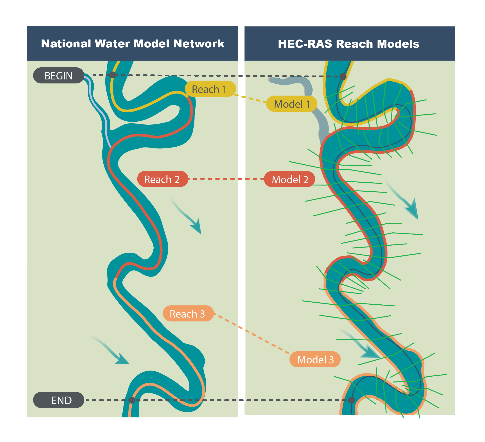

#################
Technical Summary
#################

What is ripple1d?
=================

:code:`ripple1d` is a Python utility that repurposes HEC-RAS models for use in
the production of Flood Inundation Maps (FIMs) and synthetic rating curves
(SRCs) to support near-real-time flood forecasting within NOAA’s National Water
Model (NWM).  With the utility, HEC-RAS models can be broken up into
smaller sub models for each NWM reach within the modeled domain.  Sub models
may then be used to develop reach-scale SRCs and FIM.

ripple1d currently includes functions to:

* Export HEC-RAS model geometry and metadata from proprietary HEC formats to
  geopackages and `SpatioTemporal Asset Catalog (STAC)
  <https://stacspec.org/en>`_ items;
* Associate HEC-RAS model components (e.g. cross sections, structures, etc)
  with NWM reaches;
* Create NWM reach-specific HEC-RAS models;
* Run HEC-RAS models for a range of hydraulic conditions;
* Generate reach-scale SRCs;
* Map inundation extents and depth grids; and
* Incorporate updated topographic data in mapping to reflect current site
  conditions.

Why use ripple1d?
=================

While novel methods for mapping inundation extents across broad spatial scales
are under active development, HEC-RAS models remain the industry standard, and
large collections of engineer-certified HEC-RAS models have been developed in
recent years in support of Federal Emergency Management Agency (FEMA) Digital
Flood Insurance Rate Map (DFIRM) and Base Level Engineering (BLE) initiatives.
ripple1d provides utilities to leverage these large catalogs in an operational
flood forecasting setting by aligning HEC-RAS model domains with forecast
domains. Aligning model domains reduces computational overhead and allows
models to easily interface with other modules and functions of the NWM.

How ripple1d works
==================

The following steps outline a typical workflow for setting up a HEC-RAS model
for use in FIM and SRC production.

1 - Model identification and data extraction
--------------------------------------------

(relevant endpoints: :doc:`ras_to_gpkg <endpoints/ras_to_gpkg>`)

When ripple1d is presented with a HEC-RAS project folder, it scans the
directory for a complete set of HEC-RAS project files. If a valid set is found,
ripple1d then exports the spatial extents of the cross-sections, river
centerline, structures, and junctions (along with their associated metadata) to
a geopackage file.

2 - Model and NWM network conflation
------------------------------------

(relevant endpoints: :doc:`conflate_model <endpoints/conflate_model>`, 
:doc:`compute_conflation_metrics <endpoints/compute_conflation_metrics>`)

The upstream and downstream limits of HEC-RAS models rarely align with those of
NWM reaches. Conflating in ripple1d is the process of associating sections of
HEC-RAS models with NWM reaches. To make this association, ripple1d selects NWM
reaches near the upstream and downstream boundaries of the HEC-RAS model and
traverses the NWM network between them, marking all reaches encounters. For
each of those NWM reaches, the utility identifies an upstream cross-section as
the HEC-RAS cross-section that intersects the reach closest to its upstream
end. It identifies a downstream cross-section as the HEC-RAS cross-section
**directly downstream** of the HEC-RAS cross-section that intersects the reach
closest to the downstream end.  All cross-sections between the upstream and
downstream cross-sections are marked as associated with the NWM reach.

As a part of the conflation process, ripple1d records a set of metrics that may
be used to assess how well the HEC-RAS model and NWM reaches agree. These
metrics are saved in a JSON file within the HEC-RAS model directory, and
definitions for each of the JSON fields are provided below.

* **Cross-sectional metrics.**  These metrics quantify the degree of alignment
  between the NWM reach centerline and the HEC-RAS model.  The metrics below
  are measured at each HEC-RAS cross-section and summary statistics are
  reported in the conflation metrics output.

  * **centerline_offset** measures the straightline distance between RAS centerline 
    and NWM reach line

  * **thalweg_offset** measures the straightline distance between lowest point
    along each RAS section and NWM reach line

.. image:: images/xs_metrics.png
  :width: 400
  :alt: Cross-section conflation metrics
  :align: center

* **Length metrics.** These metrics assess centerline length differences between
  HEC-RAS and the NWM reaches.

  * **ras** is the distance along the RAS centerline between upstream and
    downstream cross-section

  * **network** is the distance along the NWM reach between upstream and
    downstream cross-section
  
  * **network_to_ras_ratio** is the network length divided by ras length
  
.. image:: images/length_metrics.png
  :width: 400
  :alt: Length conflation metrics
  :align: center

* **Coverage metrics.** These metrics quantify the portion of the NWM reach
  between the upstream and downstream cross-section.

  * **start** is the ratio of NWM reach length that occurs u/s of the upstream
    cross-section

  * **end** is the ratio of NWM reach length that occurs u/s of the downstream
    cross-section

3 - Sub model creation
----------------------

(relevant endpoints: :doc:`extract_submodel <endpoints/extract_submodel>`, 
:doc:`create_ras_terrain <endpoints/create_ras_terrain>`)

Once NWM reaches have been associated with relevant parts of the HEC-RAS model,
a new HEC-RAS sub model specific to each NWM reach will be created.  Rippl1d
copies geometry between source HEC-RAS model and submodel so that the submodel
produces water surface elevation predictions consistent with the original
engineer-certified model.  For mapping inundation extents, however, ripple1d
downloads newer terrain to reflect existing conditions.  You can use terrain
from any virtual raster source, but by default, ripple1d will download a `1/3
arcsecond DEM from USGS
<https://data.usgs.gov/datacatalog/data/USGS:3a81321b-c153-416f-98b7-cc8e5f0e17c3>`_

4 - SRC development and FIM pre-processing
------------------------------------------

(relevant endpoints: 
:doc:`create_model_run_normal_depth <endpoints/create_model_run_normal_depth>`, 
:doc:`run_incremental_normal_depth <endpoints/run_incremental_normal_depth>`, 
:doc:`run_known_wse <endpoints/run_known_wse>`, 
:doc:`create_fim_lib <endpoints/create_fim_lib>`)

Once submodel geometry has been set up, you can run various discharges through
the model and record the results.  Ripple1d has several tools to develop
SRCs for a NWM reach.  

* **Initial Normal Depth Run.** Discharges ranging from 1.2 times the reach
  high flow threshold to the reach 1% AEP discharge will be incrementally run
  through the reach submodel, and their associated flow depths at each
  cross-section are recorded.  If the source model min flow is lower than 1.2
  times the high flow threshold or the source model max flow is higher than the
  1% AEP discharge, those flow bounds will be used instead

* **Regularized Normal Depth Run.**  After the initial depth-discharge curve
  has been established, ripple1d will attempt to generate a new depth-discharge
  curve at regular depth intervals.  Discharges determined by interpolating a
  regular depth increment along the initial depth-discharge curve will be
  incrementally run through the model, and the new curve will be recorded.

* **Known Water Surface Elevation Run.**  An advantage of HEC-RAS over
  lower-complexity FIM methods is its ability to consider downstream hydraulic
  conditions.  ripple1d pre-processes SRCs for a range of conditions by
  iterating the downstream boundary condition over a range of water surface
  elevations.

Ripple1d generates HEC-RAS inundation depth grids for each of the known water
surface elevation runs.  These grids are cached along with their associated
discharges and downstream conditions so that reach-scale FIM may be retrieved
as soon as a reach forecast is released.